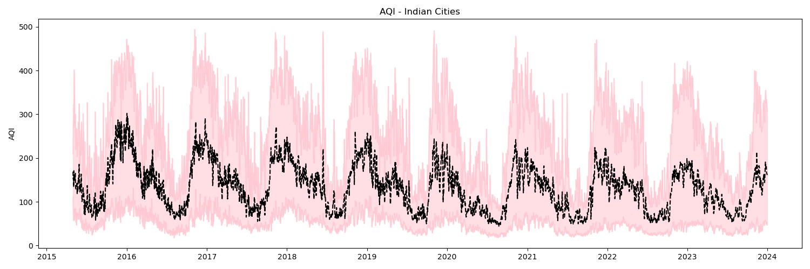
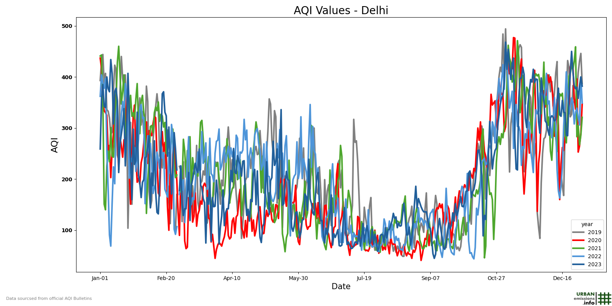

# ClimateVisuals

## Raster Grids

`Raster Grids.ipynb` has the script to produce Raster maps like this. 

Climate data like temperatures, pollutant values are often represented as rasters. In this script, we will plot one such climate data variable over India at 0.1 degree gridsize resolution.

## Ribbon Charts
`Ribbon Charts.ipynb` has the script to produce Ribbon Charts like this

Generally, a time-series chart represents the aggregate value (mean, median, sum etc.,) of a variable on a given time unit (day, week, month etc). But what if you want to represent the variation in the data as well? Ribbon charts are useful here - in representing the distribution of data in a time-series. This distribution is presented as min-max or 5-95 percentile data on a given time stamp.

## Season Plots
`Season Plot.ipynb` has the script to produce season plots like this

They are useful for visualising seasonality in the climate data, especially when we have data for multiple years.