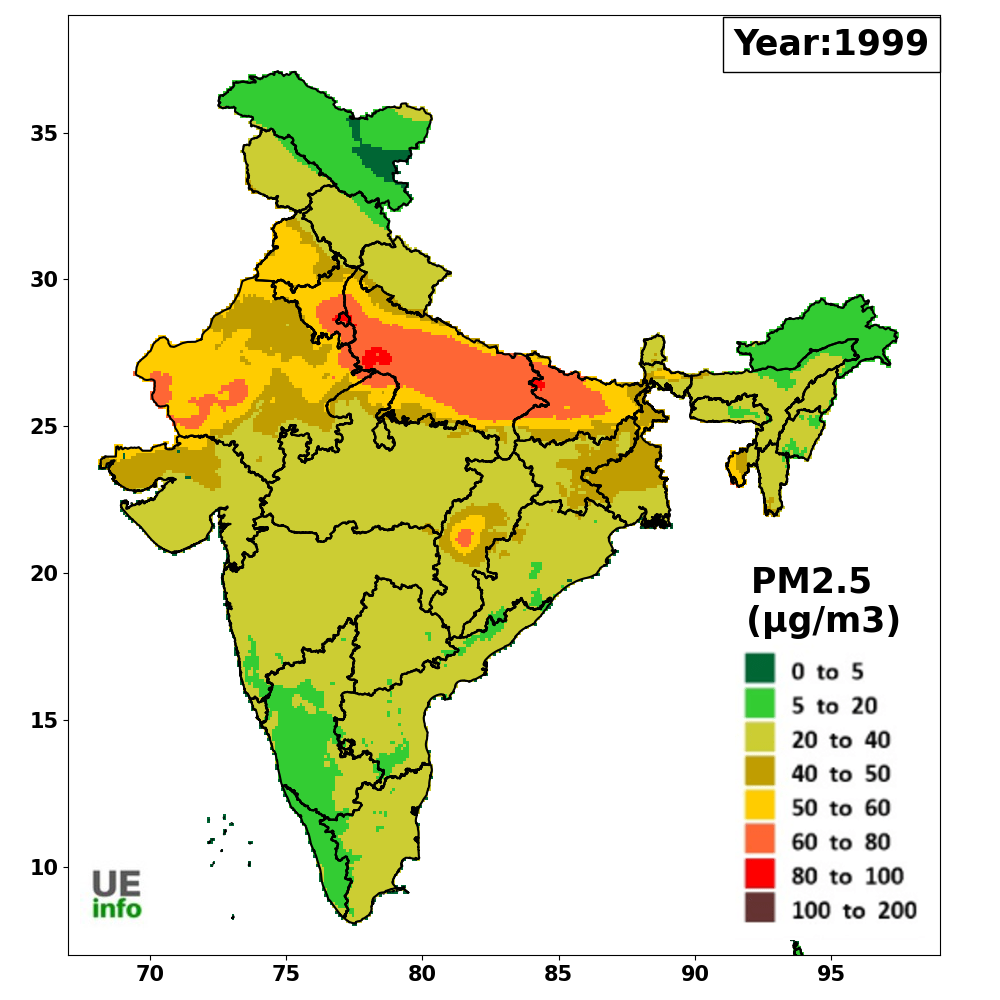

# ClimateVisuals

## Raster Grids

`Raster Grids.ipynb` has the script to produce Raster maps like this. 

Climate data like temperatures, pollutant values are often represented as rasters. In this script, we will plot one such climate data variable over India at 0.1 degree gridsize resolution.
